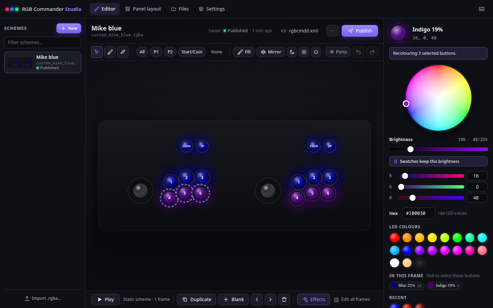
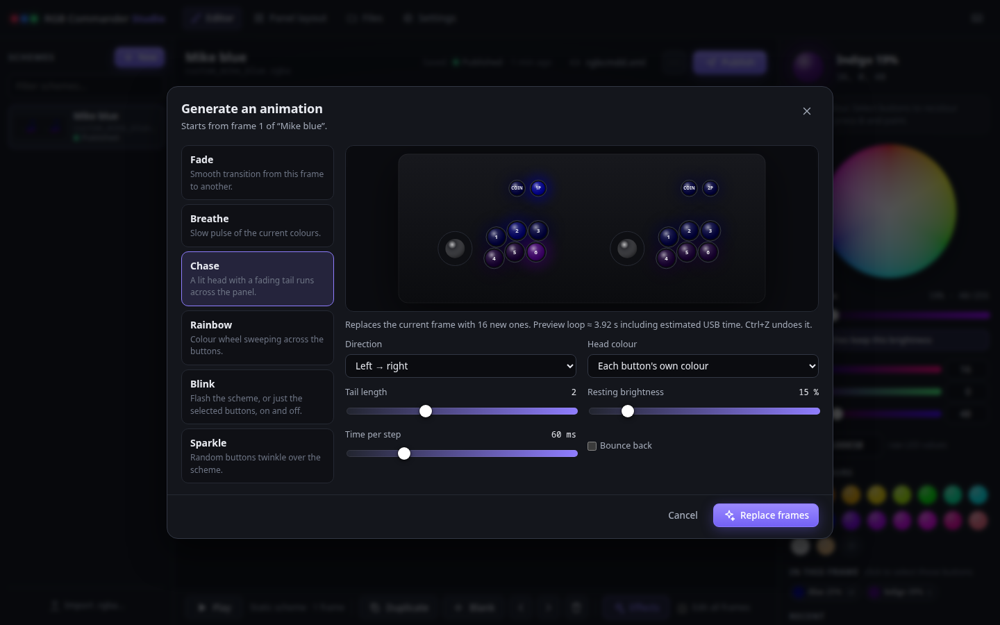
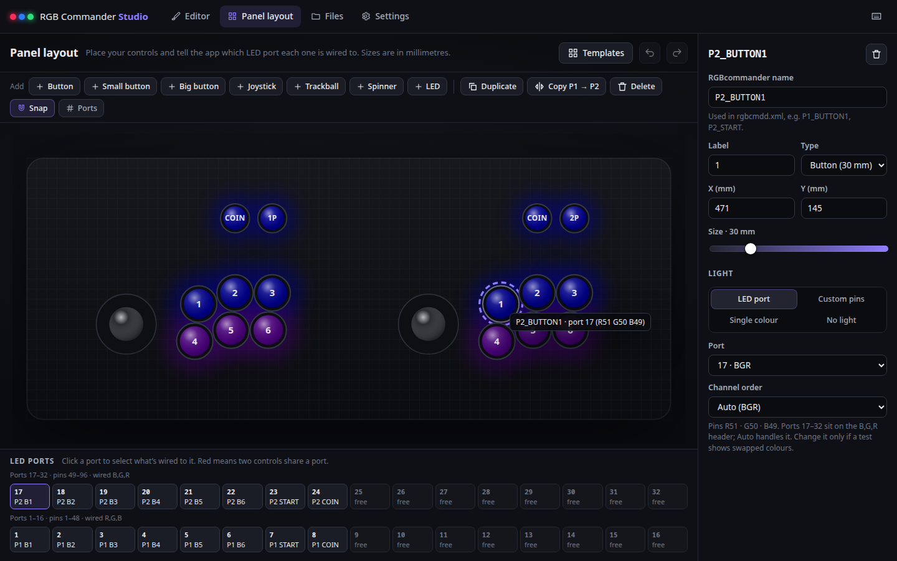

# RGB Commander Studio

Design button lighting for your arcade cabinet in a browser, see it glow the way the LEDs will, and publish [RGBcommander](https://web.archive.org/web/2022/http://users.telenet.be/rgbcommander/) `.rgba` files to a share that Syncthing carries to the cabinet.

Built for the **Ultimarc I-PAC Ultimate I/O** (96 LED pins, 32 RGB LEDs). The PacLED64 works too.



- **Paint your real panel.** Lay out your controls once (sizes in mm, starter templates included), tell the app which LED port each one uses, then click or drag across buttons to colour them.
- **Colour picking built for LEDs.** A hue/saturation wheel with a separate brightness slider. With "keep brightness" on, swatches change the hue but keep the brightness you set, so clicking Blue at 25% gives `0,0,64`. Brightness scales each selected button's own colour. Also: RGB sliders, hex, colours used in this frame, recent colours, all 141 named colours from `rgbcmdd.xml`, an eyedropper, copy/paste, and mirroring between P1 and P2.
- **Previews that look like the cabinet.** LED values are light output (PWM), so `0,0,64` is drawn as the medium blue it really is, not near-black.
- **Animations.** A frame timeline, playback at the speed the cabinet will actually run, and generators for fade, breathe, chase, rainbow, blink and sparkle.
- **Safe publishing.** Autosave, undo/redo, atomic writes, confirmation before replacing a file the app didn't write, and backups of anything replaced or deleted.
- **`rgbcmdd.xml` helpers.** Copy-paste snippets for playing a file, for the `<ledboard>` hardware block (BGR pins handled), and for turning a scheme into static `<colour>`/`<rom>` colours.

## How it fits together

```
browser ──> RGB Commander Studio (Unraid container)
                 │ writes custom_mike_blue.rgba
                 ▼
            /mnt/user/syncthing/rgbcommander/rgba   (Unraid share)
                 │ Syncthing
                 ▼
            /usr/sbin/rgbcommander/rgba              (cabinet)
                 │ RGBcommander restarts (helper below) and loads it
                 ▼
            buttons light up
```

## 1. Run it on Unraid with Docker Compose

Unraid doesn't ship Docker Compose, so first install **Compose Manager Plus** from the **Apps** tab. It replaces the older Docker Compose Manager plugin, which is deprecated, and adds a **Compose** section to the **Docker** tab.

1. **Add the stack.** In **Docker → Compose**, click **Add Stack** and name it `rgb-commander-studio`. When the editor opens, paste in this repository's [`docker-compose.yml`](docker-compose.yml):

   ```yaml
   # RGB Commander Studio on Unraid (Compose Manager Plus) or any Docker host.
   # Change the host side (left of each colon) of the port and folders to suit.
   services:
     rgb-commander-studio:
       image: ghcr.io/orestes7272/rgb-commander-config-generator:latest
       # To build on the server instead of pulling, copy the repository there,
       # replace the image line with this one and use "Build & Up":
       # build: /mnt/user/appdata/rgb-commander-studio-src
       container_name: rgb-commander-studio
       restart: unless-stopped
       ports:
         - "8080:8080" # web UI
       environment:
         PUID: "99" # write files as nobody:users, like the rest of the array
         PGID: "100"
         UMASK: "002"
         # AUTH_PASSWORD: "change-me" # optional login, user name "admin"
       volumes:
         - /mnt/user/appdata/rgb-commander-studio:/config # schemes, layout, settings, backups
         - /mnt/user/syncthing/rgbcommander/rgba:/output # published .rgba files; share this folder with Syncthing
       labels:
         # WebUI link and icon on Unraid's Docker tab
         net.unraid.docker.webui: "http://[IP]:[PORT:8080]/"
         net.unraid.docker.icon: "https://raw.githubusercontent.com/orestes7272/rgb-commander-config-generator/main/public/icon-256.png"
   ```

   Check the two folders on the left of the `volumes` lines:
   - `/mnt/user/appdata/rgb-commander-studio` holds the app's schemes, panel layout, settings and backups.
   - `/mnt/user/syncthing/rgbcommander/rgba` is where published `.rgba` files go: the folder you'll share with the cabinet in step 2. Keep it inside a share that already exists (add one under **Shares** if needed); Docker creates any missing subfolders.

   Change the first `8080` if that port is taken, and uncomment `AUTH_PASSWORD` if you want a login. Save with Ctrl+S.
2. **Start it.** Click **Compose Up**, then open `http://tower:8080` or use the container's **WebUI** link on the Docker tab.
3. **Update it later** with **Pull & Up** from the stack's menu, or turn on the stack's automatic update checks.

### Where the image comes from

The stack pulls `ghcr.io/orestes7272/rgb-commander-config-generator:latest`, which GitHub builds for you. Every push to `main` runs the tests and publishes a fresh image (see `.github/workflows/container.yml`). After the first build finishes, open **Packages → rgb-commander-config-generator → Package settings** on GitHub and set the visibility to **Public**, so Unraid can pull it without logging in.

To keep the image private instead, log Unraid in to GitHub's registry once from the terminal. Use a personal access token with the `read:packages` scope as the password:

```sh
docker login ghcr.io -u orestes7272
```

The Docker tab icon only loads while the repository is public, but everything else works either way.

**Or build it on the server.** Copy this repository to `/mnt/user/appdata/rgb-commander-studio-src` (the `appdata` share works), replace the `image:` line with the commented `build:` line, and use **Build & Up** instead of **Compose Up**. Build & Up again whenever you update the copy.

### How it runs

The container starts as root only long enough to take ownership of folders Docker just created. It then switches to `PUID:PGID` (99:100, nobody:users), so files land on the share like everything else on the array. If the output folder already belongs to another user, for example a Syncthing container running as 1000, publishing stops with a message explaining the fix, and a warning stays in the app's top bar until it's sorted.

Prefer Unraid's classic **Add Container** form? [`unraid/rgb-commander-studio.xml`](unraid/rgb-commander-studio.xml) is a ready-made template with the same settings.

## 2. Sync to the cabinet with Syncthing

**On Unraid** (e.g. the Syncthing app from Community Applications): add a folder whose path, inside the Syncthing container, is the share you mapped to `/output`. For example, if Syncthing maps `/mnt/user/syncthing` to `/sync`, the folder path is `/sync/rgbcommander/rgba`. Share it with the cabinet.

**On the cabinet** (RetroPie on a Raspberry Pi, or any Debian):

```sh
sudo apt install syncthing
sudo systemctl enable --now syncthing@pi
# The GUI listens on the Pi itself; reach it from your PC with an SSH tunnel:
ssh -L 8384:localhost:8384 pi@retropie   # then browse to http://localhost:8384
```

Accept the shared folder and set its path to RGBcommander's rgba folder, `/usr/sbin/rgbcommander/rgba` (RecalBox: `/recalbox/share/system/rgbcommander/rgba`).

That folder belongs to root, so first hand it to the Syncthing user **and** install the auto-restart helper. RGBcommander only reads animations when it starts, so without a restart new files do nothing. Copy the `device/` folder to the Pi, then:

```sh
cd device
sudo ./install-reload-helper.sh /usr/sbin/rgbcommander/rgba pi
```

From then on, about 10 seconds after Syncthing delivers a file, `rgbcommander` restarts and loads it. (Restarting in the middle of a game resets the lights for that game, so publish between games.)

**Tips**

- Use **Send & Receive** on both sides. The stock animations and files you already have (like `custom_mike_blue.rgba`) then show up in the app's **Files** tab, ready to open and edit. Deleting a file in the app deletes it on the cabinet too; a backup stays in the app data folder.
- Add `._*` to Syncthing's ignore patterns on both sides. macOS "._" files ending in `.rgba` crash RGBcommander.
- The app writes through `.syncthing.*.tmp` temp files, which Syncthing never syncs, so a half-written file can't reach the cabinet.

## 3. Using the app

1. **Panel layout.** Pick the template closest to your panel, drag controls into place, and set each one's LED port. The port map at the bottom shows what's on each port and flags conflicts. Not sure of your wiring? Create a scheme from the **Wiring test: port walk** starter, publish it, set it as `rgbadefault` and watch which button lights at each step. **Wiring test: all red** reveals buttons whose channel order is wrong (they'll show blue or green).
2. **Editor.** Select buttons (click, drag across them, drag a box, Shift/Ctrl to add, double-click for "same colour", or the All/P1/P2 chips) and pick a colour. Or pick a colour and switch to Paint (**B**). **Alt**+click picks a colour from a button. Press **?** for all shortcuts.
3. **Animate.** Add frames, set each frame's time, or use **Effects**, which previews live before you apply it. Press Space to preview at cabinet speed.

   
4. **Publish** (Ctrl+Enter) writes `<file name>.rgba` to the output folder.
5. **rgbcmdd.xml** in the header shows how to use the file, for example `<option … rgbadefault="custom_mike_blue" …/>` to play it while EmulationStation runs.



## What the app knows about RGBcommander

Checked against RGBcommander 0.4.0.5: its documentation, its stock files, and how the daemon actually parses and plays `.rgba` files.

| Fact | What the app does about it |
|---|---|
| An `.rgba` file is `<anim>` with one `<frm dec="…"/>` per frame and a `<tms dec="…"/>` list with one delay per frame. | Writes exactly that, tab-indented with CRLF line endings like the stock files. |
| Each frame value is one LED pin, 0–255. Short frames repeat across the pins (a 32-value stock frame shows three times on 96 pins). | Always writes all 96 values. Imports expand short frames the same way the daemon does. |
| On the Ultimate I/O, pins 1–48 are wired R,G,B and pins 49–96 are **B,G,R**. That's why your file has `0,0,64` for blue on one side and `64,0,0` on the other. | LED ports use the right order automatically ("Auto"); you can override it per button. |
| Values are stored as a byte: 300 silently becomes 44. This includes frame delays, so one frame can last at most **255 ms**. | Never writes anything above 255. Longer holds are split into repeated frames (the ×N badge). |
| Before each frame's delay, the daemon writes every pin to the board over USB. A 255 ms frame measures about 440 ms on real hardware. | Previews add an estimated write time per frame (Settings → USB write time; about 185 ms by default). |
| `rgbaspeed` / `rgbadefaultspeed`: in 0.4.0.5 any value from 100–150 plays at normal speed, and anything below 100 drops the delays entirely. | Snippets use 100. |
| Animations load only when the daemon starts. | The helper above restarts it when files change. |
| The animation name is the file name without `.rgba`, and it's case-sensitive. `OFF`, `RANDOM` and `STATIC` are reserved. | File names are limited to letters, numbers, `-` and `_`, and reserved names are refused. |

## Configuration

| Variable | Default | Meaning |
|---|---|---|
| `PORT` | `8080` | HTTP port |
| `DATA_DIR` | `/config` | Schemes (`projects/`), `layout.json`, `settings.json`, `backups/` |
| `OUTPUT_DIR` | `/output` | Where `.rgba` files are published |
| `PUID`, `PGID` | `99`, `100` | User and group to run as when started as root |
| `UMASK` | `002` | Octal umask for new files |
| `AUTH_PASSWORD` | *(unset)* | Turns on HTTP basic auth |
| `AUTH_USER` | `admin` | User name for basic auth |
| `BACKUPS_PER_FILE` | `10` | Backups kept per replaced or deleted file |

The app is meant for your LAN. It rejects cross-site requests, but if you expose it beyond your network, set `AUTH_PASSWORD` and put it behind HTTPS.

## Development

No dependencies and no build step: Node 22.2 or newer and a browser.

```sh
npm test       # node:test suites for the file format, wiring, effects and API
npm run dev    # http://localhost:8080, data in .dev/
npm run icon   # regenerate public/icon-256.png
```

```
server/          HTTP server and JSON API
public/          the web app (plain ES modules)
public/js/core/  file format, wiring, colours, effects: shared by browser and server
test/            tests (test/fixtures holds a real hand-edited .rgba)
device/          cabinet-side auto-restart helper
unraid/          optional Unraid template (the compose file is the main route)
```

To try the container locally, build it with `docker build -t rgb-commander-studio .`.

RGBcommander is © Gijsbrecht De Waegeneer. This project only reads and writes its file format.
